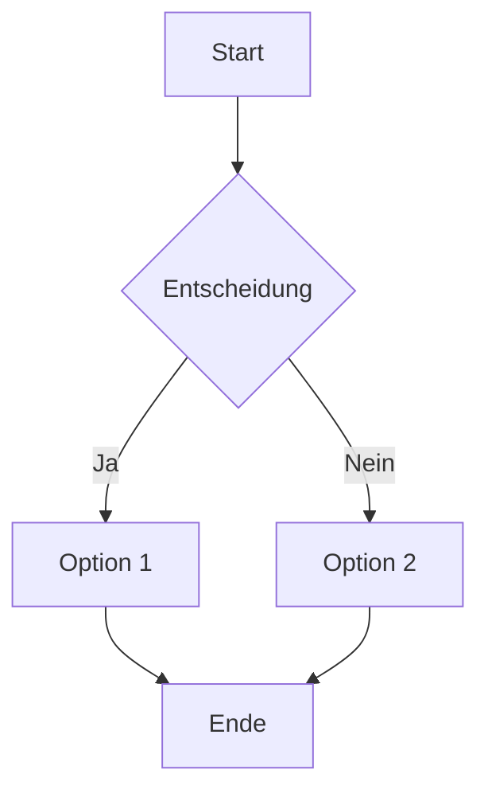
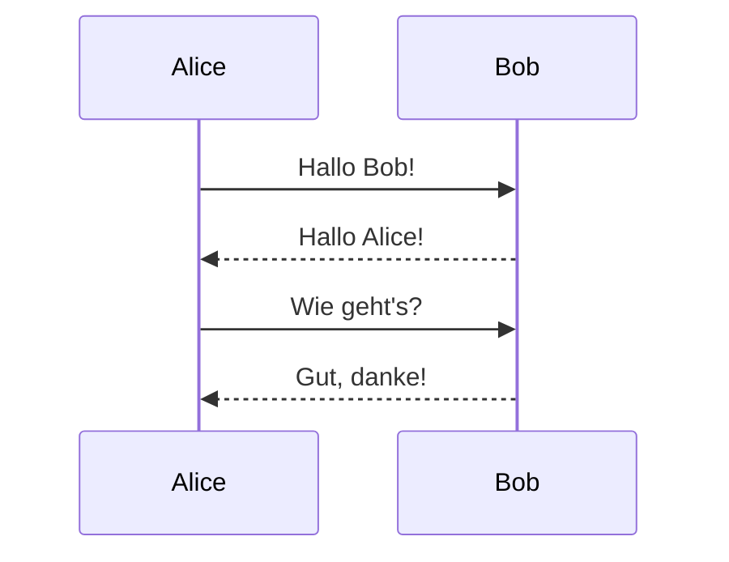
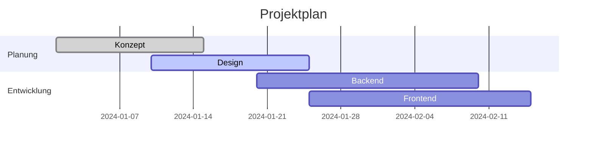

# Kollaborative Pads - Vollständiges Handbuch

## Einführung

**Pads** sind ein **Echtzeit-Kollaborationstool** für Markdown-Dokumente. Du kannst gemeinsam mit anderen Personen Notizen schreiben, Daten analysieren und Code ausführen - alles in einem einzigen, geteilten Dokument.

**Hauptfeatures:**
- **Echtzeit-Kollaboration** ohne Anmeldung
- **Markdown-Editor** mit Live-Vorschau
- **Code-Ausführung** für Python, JavaScript und SQL
- **Datenanalyse** mit CSV/Excel-Import
- **Lokale Datenspeicherung** - der Server speichert nichts

Teile einfach den Link zu deinem Pad und arbeitet sofort zusammen!

## Arbeitsbereich

### Ansichtsmodi

Du kannst zwischen drei verschiedenen Ansichten wechseln:

- **Editor**: Nur der Markdown-Editor
- **Split**: Editor und Vorschau nebeneinander
- **Vorschau**: Nur die gerenderte Ausgabe

Die Ansicht lässt sich über das Menü oder direkt über URL-Parameter ändern.

### Datei-Operationen

- **Kopieren**: Pad-Inhalt in die Zwischenablage kopieren
- **Download**: Als `.md`-Datei herunterladen
- **Automatisches Speichern**: Alle Änderungen werden lokal gespeichert

## Markdown-Syntax

Pads verwenden **Standard-Markdown** mit erweiterten Features für Mathematik und Code-Ausführung.

### Grundlegende Formatierung

**Text-Formatierung:**
```markdown
**Fettschrift** oder __Fettschrift__
*Kursiv* oder _Kursiv_
~~Durchgestrichen~~
`Inline-Code`
```

**Überschriften:**
```markdown
# Überschrift 1
## Überschrift 2
### Überschrift 3
```

**Listen:**
```markdown
- Ungeordnete Liste
- Zweiter Punkt
  - Verschachtelt

1. Geordnete Liste
2. Zweiter Punkt
3. Dritter Punkt
```

**Links und Bilder:**
```markdown
[Linktext](https://example.com)

```

### Tabellen

Erstelle Tabellen mit der Standard-Markdown-Syntax:

```markdown
| Spalte 1 | Spalte 2 | Spalte 3 |
|----------|----------|----------|
| Zeile 1  | Daten    | Mehr     |
| Zeile 2  | Daten    | Mehr     |
```

### Code-Blöcke

Für Code-Highlighting verwende dreifache Backticks:

````markdown
```javascript
function helloWorld() {
    console.log("Hello World!");
}
```
````

### Mathematik mit KaTeX

**Inline-Mathematik:**
```markdown
Die Formel $E = mc^2$ ist berühmt.
```

**Block-Mathematik:**
```markdown
$$
\int_0^\infty e^{-x^2} dx = \frac{\sqrt{\pi}}{2}
$$
```

**Beispiele für komplexere Formeln:**

Matrizen:
```markdown
$$
\begin{pmatrix}
a & b \\
c & d
\end{pmatrix}
$$
```

Summen und Produkte:
```markdown
$$
\sum_{i=1}^n x_i = x_1 + x_2 + \cdots + x_n
$$
```

### Diagramme mit Mermaid

Erstelle interaktive Diagramme direkt im Markdown mit `mermaid`-Code-Blöcken:

**Flowchart:**


**Sequence Diagram:**


**Gantt Chart:**


**Class Diagram:**
```mermaid
classDiagram
    class User {
        +String name
        +String email
        +login()
        +logout()
    }
    class Pad {
        +String id
        +String content
        +Date updated
        +save()
        +load()
    }
    User ||--o{ Pad : creates
```

### Blockquotes

```markdown
> Dies ist ein Zitat.
> Es kann mehrere Zeilen haben.
> 
> > Verschachtelte Zitate sind auch möglich.
```

### To-Do Listen

```markdown
- [ ] Unerledigte Aufgabe
- [x] Erledigte Aufgabe
- [ ] Noch eine Aufgabe
  - [x] Unteraufgabe erledigt
  - [ ] Unteraufgabe offen
```

## Kollaboration und Synchronisation

### Grundprinzip

Sobald zwei Personen das gleiche Pad mit derselben ID öffnen, arbeiten sie automatisch kollaborativ zusammen. Um andere einzuladen, teilst du einfach den Link des Pads. Alle Änderungen werden in Echtzeit zwischen den Teilnehmern synchronisiert.

### Datenmodell und Speicherung

Das System basiert auf einem dezentralen Ansatz: Alle Updates werden nur lokal bei den Teilnehmern gespeichert. Der Server speichert keine Daten und dient ausschließlich als Relay für die Übertragung der Änderungen zwischen den Clients.

Für die Echtzeit-Synchronisation müssen alle Teilnehmer gleichzeitig online sein. Offline-Arbeit ist jedoch möglich - beim nächsten gemeinsamen Online-Sein werden alle Änderungen automatisch und konfliktfrei zusammengeführt.

### Benutzeranzeige

Aktuelle Online-Nutzer werden unten im Editor angezeigt. Über einen Klick auf die Benutzeranzeige lässt sich der eigene Anzeigename ändern, der dann anderen Teilnehmern angezeigt wird.

## Code-Ausführung

Das Pad bietet die Möglichkeit, Code direkt im Browser auszuführen. Die Ausgaben werden nur lokal angezeigt und nicht zwischen den Nutzern synchronisiert, wodurch jeder Teilnehmer individuell experimentieren kann.

### Python

Python-Code wird über Pyodide im Browser ausgeführt. Das System unterstützt viele populäre Pakete wie numpy, pandas, matplotlib und requests. Weitere Pakete können über micropip nachinstalliert werden.

```python
import matplotlib.pyplot as plt
import numpy as np

x = np.linspace(0, 10, 100)
y = np.sin(x)
plt.plot(x, y)
plt.show()
```

Matplotlib-Plots werden automatisch als Bilder in der Ausgabe eingebettet und können bei Bedarf ausgeblendet werden.

### JavaScript

JavaScript-Code wird direkt in der Browser-Umgebung ausgeführt. Sowohl synchroner als auch asynchroner Code wird unterstützt.

```javascript
console.log("Hello World");
const result = [1, 2, 3].map(x => x * 2);
console.log(result);

// Async code works too
const data = await fetch('/api/data');
console.log(await data.json());
```

### SQL und Datenanalyse

SQL-Code-Blöcke bieten eine vollständige SQLite-Umgebung mit erweiterten Funktionen für Datenimport und -export.

```sql
--? SHOW INFO
SELECT 1 as test;
```

#### Meta-Befehle

SQL unterstützt spezielle Meta-Befehle mit dem Prefix `--?` für erweiterte Funktionen:

**Datenbank-Management:**
```sql
--? LOAD "projektname" FROM STORAGE
--? LOAD "projektname" FROM FILE TO STORAGE
--? DELETE "datenbankname"
```

**Datenimport:**
```sql
--? IMPORT FILE AS "tabellenname"
--? IMPORT FILE AS "tabellenname" OVERWRITE
```

Der Import unterstützt CSV- und Excel-Dateien (.xlsx, .xls) mit automatischer Typerkennung für die Spalten.

**Informationen anzeigen:**
```sql
--? SHOW INFO
--? SHOW INFO FULL
```

#### Datenbank-Features

Das SQL-System bietet umfangreiche Funktionen für die Datenanalyse. Abfrageergebnisse können als CSV exportiert werden, und die komplette Datenbank lässt sich als .db-Datei herunterladen. Alle Datenbanken werden persistent im Browser-Storage gespeichert und bleiben auch nach dem Schließen des Tabs verfügbar.