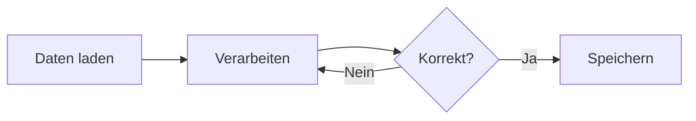

# HowTo

:::info
Hinweis: Änderungen in diesem **HowTo** Pad werden nicht gespeichert.
:::

:::note
Willkommen bei **Pad**! Du arbeitest hier mit einem erweiterten Markdown-Editor, der deine Texte intelligent formatiert und Code ausführen kann. Deine Pads werden automatisch verschlüsselt auf dem Server gespeichert und Änderungen können in Echtzeit mit anderen geteilt werden.
:::

## Markdown Formatierung

:::info
Markdown ist eine einfache Textformatierung, die automatisch in schöne Darstellung umgewandelt wird.
:::

**Textformatierung:**
- `**fett**` -> **fett**
- `*kursiv*` -> *kursiv*  
- `~~durchgestrichen~~` -> ~~durchgestrichen~~
- `` `Code` `` -> `Code`

**Überschriften:** `# H1`, `## H2`, `### H3`

**Listen:**
- `- Punkt` für ungeordnete Listen
- `1. Punkt` für nummerierte Listen
- `- [ ] Todo` für Checkboxen

**Links & Bilder:**
- `[Text](https://url.com)` -> [Text](https://url.com)
- `` für Bilder

**Weitere Features:**
- `> Zitat` für Blockquotes
- `---` für horizontale Linien
- `:emoji:` -> 😊 (z.B. `:smile:`, `:heart:`, `:rocket:`)
- `` ```sprache `` für Code-Blöcke

## Intelligente Blöcke

Pad rendert verschiedene Markdown-Elemente automatisch zu interaktiven Komponenten. Klicke einfach darauf, um zwischen Ansicht und Bearbeitung zu wechseln.

:::info
**Tipp:** Klicke auf formatierte Elemente wie diese Info-Box, Tabellen oder Formeln, um sie zu bearbeiten!
:::

### Info-Blöcke

:::note
**Note** ist nützlich wenn du etwas einfach besonders hervorheben möchtest.
:::

:::info
**Info** Ergibt blaube Boxen für hilfreiche Informationen
:::

:::success
**Erfolg!** Diese grüne Box eignet sich für positive Meldungen.
:::

:::warning
**Achtung:** Gelbe Boxen für wichtige Hinweise.
:::

:::danger
**Gefahr:** Rote Boxen für kritische Warnungen.
:::

### Tabellen

| Produkt | Preis | Lager |
|---------|-------|-------|
| Laptop | 899€ | 12 |
| Maus | 29€ | 45 |
| Tastatur | 79€ | 23 |

### Mathematische Formeln

Die Gaußsche Normalverteilung: $f(x) = \frac{1}{\sigma\sqrt{2\pi}} e^{-\frac{1}{2}(\frac{x-\mu}{\sigma})^2}$

Oder als Block für komplexere Formeln:

$$
\int_{-\infty}^{\infty} e^{-x^2} dx = \sqrt{\pi}
$$

### To-Do Listen

- [x] Markdown lernen
- [x] Pad ausprobieren
- [ ] Code ausführen
- [ ] Daten analysieren

### Bilder


### Diagramme mit Mermaid

:::info
Bearbeiten den `mermaid` Codeblock um das Diagramm zu verändern.
:::



## Code-Ausführung mit Kit API

Das Pad kann JavaScript-Code direkt in deinem Browser ausführen. Die **Kit API** bietet dabei Werkzeuge für Datenverarbeitung, Dateien und mehr.

### Erste Schritte

```javascript
// Nach dem Namen fragen
const name = await kit.dialog.prompt("Wie heißt du?");

// Ergebnis ausgeben
console.log(`Hallo ${name}!`);
```

### Dateien verarbeiten

```javascript
// CSV von URL laden
const file = await kit.file.fetch('/docs/example.csv');
const data = await kit.sheet.fromCsv(file);

// Erste 3 Zeilen anzeigen
console.table(data.slice(0, 3));

// Ergebnis als CSV speichern
const csv = kit.sheet.toCsv(data);
kit.file.save(csv, 'meine-daten.csv');
```

### Datenbank-Operationen

```javascript
// Temporäre Datenbank (wird nach Reload gelöscht)
await kit.db.use('memory://temp');

// Tabelle erstellen und Daten einfügen
await kit.db.exec(`
  CREATE TABLE users (
    id INTEGER PRIMARY KEY,
    name TEXT,
    age INTEGER
  )
`);

await kit.db.exec(
  'INSERT INTO users (name, age) VALUES (?, ?)',
  ['Alice', 30]
);

// Daten abfragen
const users = await kit.db.exec('SELECT * FROM users');
console.table(users);

// Datenbank löschen
await kit.db.destroy('memory://temp');
```

### SQL-Codeblöcke

Du kannst SQL-Befehle auch direkt in SQL-Codeblöcken ausführen. Diese nutzen automatisch die aktuell ausgewählte Datenbank oder eine temporäre memory-Datenbank.

:::warning
Bei mehreren SQL-Befehlen in einem Block wird nur das Ergebnis des **letzten** Befehls angezeigt!
:::

```sql
-- Tabelle erstellen
CREATE TABLE IF NOT EXISTS products (
    id INTEGER PRIMARY KEY,
    name TEXT NOT NULL,
    price REAL
);

-- Daten einfügen
INSERT INTO products (name, price) VALUES 
    ('Laptop', 899.99),
    ('Mouse', 29.99);

-- Daten abfragen (wird als Tabelle angezeigt)
SELECT * FROM products;
```

### Persistente Datenspeicherung

:::warning
Persistente Datenbanken werden nur auf deinem Geräte gespeichert und nicht mit den anderen Geräten synchronisiert!
:::

```javascript
// Persistente Datenbank (überlebt Reload)
await kit.db.use('opfs://meine-db');

// CSV importieren
const file = await kit.file.fetch('/docs/example.csv');
const orders = await kit.sheet.fromCsv(file);
await kit.db.importData('orders', orders);

// Komplexe Abfrage mit JOIN
const result = await kit.db.exec(`
  SELECT 
    customer_name,
    COUNT(*) as total_orders,
    SUM(quantity * unit_price) as total_spent
  FROM orders
  WHERE status = 'delivered'
  GROUP BY customer_name
  ORDER BY total_spent DESC
  LIMIT 5
`);

console.table(result);
```

### Key-Value Storage

```javascript
// Daten persistent speichern
await kit.store.set('user-settings', {
  theme: 'dark',
  language: 'de',
  notifications: true
});

// Später wieder abrufen
const settings = await kit.store.get('user-settings');
console.log(settings);

// Alle gespeicherten Keys auflisten
const keys = await kit.store.list();
console.log('Gespeicherte Keys:', keys);
```

### Praktisches Beispiel: Datenanalyse

```javascript
// CSV laden und in Datenbank importieren
const file = await kit.file.fetch('/docs/example.csv');
const data = await kit.sheet.fromCsv(file);

await kit.db.use('memory://analyse');
await kit.db.importData('orders', data);

// Umsatz pro Monat berechnen
const monthlyRevenue = await kit.db.exec(`
  SELECT 
    strftime('%Y-%m', order_date) as month,
    COUNT(*) as orders,
    ROUND(SUM(quantity * unit_price), 2) as revenue
  FROM orders
  WHERE order_date IS NOT NULL
  GROUP BY month
`);

console.table(monthlyRevenue);

// Top-Produkte ermitteln
const topProducts = await kit.db.exec(`
  SELECT 
    product,
    SUM(quantity) as total_sold,
    ROUND(AVG(unit_price), 2) as avg_price
  FROM orders
  GROUP BY product
  ORDER BY total_sold DESC
  LIMIT 5
`);

console.table(topProducts);

// Ergebnisse exportieren
kit.file.save(
  kit.sheet.toCsv(monthlyRevenue),
  'monatsumsatz.csv'
);
kit.file.save(
  kit.sheet.toCsv(topProducts),
  'top-produkte.csv'
);
```

## Weitere Kit API Features

### Datum und Zeit

```javascript
// Aktuelles Datum
const heute = kit.date.now();
console.log(heute.format('DD.MM.YYYY'));

// Datum manipulieren
const morgen = heute.add(1, 'day');
const naechsteWoche = heute.add(7, 'days');

// Differenz berechnen
const diff = naechsteWoche.diff(heute, 'days');
console.log(`Tage bis nächste Woche: ${diff}`);
```

### Utility-Funktionen

```javascript
// Verzögerung einbauen
console.log('Start...');
await kit.util.sleep(2000);
console.log('2 Sekunden später!');

// Zufallszahlen
const zufall = kit.util.random(1, 100);
console.log(`Zufallszahl: ${zufall}`);

// Array mischen
const zahlen = [1, 2, 3, 4, 5];
kit.util.shuffle(zahlen);
console.log('Gemischt:', zahlen);
```

## Zusammenarbeit

Teile einfach den Link deines Pads - andere können sofort mitarbeiten! Die Synchronisation erfolgt in Echtzeit und alle Änderungen werden konfliktfrei zusammengeführt.

:::info
**Datenschutz:** Deine Pads werden asymmetrisch verschlüsselt auf dem Server gespeichert. Das heißt, dass der Server die Inhalte nicht lesen kann, sondern nur du und die anderen Teilnehmenden. Diese Ende-zu-Ende-Verschlüsselung garantiert, dass nur Personen mit dem Pad-Link auf die Inhalte zugreifen können.
:::

## ChatGPT und Co

Für erweiterte Hilfe zur Kit API kannst du die [KI-Dokumentation](/docs/pad-llms.txt) nutzen. Kopiere den Inhalt dieser Dateo und füge ihn in deinen bevorzugten KI-Assistenten ein, um interaktive Hilfe beim Programmieren zu erhalten.

## Tastenkürzel

- **Tab**: Einrücken (2 Leerzeichen)
- **Strg/Cmd + F**: Suchen
- **Strg/Cmd + H**: Suchen & Ersetzen
- **Strg/Cmd + Z**: Rückgängig
- **Strg/Cmd + Shift + Z**: Wiederholen

Viel Spaß beim Erkunden der Pad-Features!